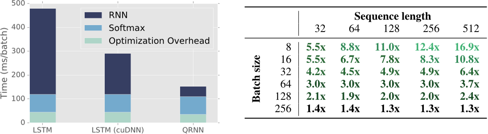

# Quasi-Recurrent Neural Network (QRNN) for PyTorch

This repository contains a PyTorch implementation of [Salesforce Research](https://einstein.ai/)'s [Quasi-Recurrent Neural Networks](https://arxiv.org/abs/1611.01576) paper.

The QRNN provides similar accuracy to the LSTM but can be betwen 2 and 17 times faster than the highly optimized NVIDIA cuDNN LSTM implementation depending on the use case.

To install, simply run:

`pip install git+https://github.com/salesforce/pytorch-qrnn`

If you use this code or our results in your research, please cite:

```
@article{bradbury2016quasi,
  title={{Quasi-Recurrent Neural Networks}},
  author={Bradbury, James and Merity, Stephen and Xiong, Caiming and Socher, Richard},
  journal={International Conference on Learning Representations (ICLR 2017)},
  year={2017}
}
```

## Software Requirements

This codebase requires Python 3, [PyTorch](http://pytorch.org/), [pynvrtc](https://github.com/NVIDIA/pynvrtc) (NVIDIA's Python Bindings to NVRTC), and [CuPy](https://cupy.chainer.org/).
While the codebase contains a CPU implementation of the QRNN, the GPU QRNN implementation is used by default if possible.
Requirements are provided in `requirements.txt`.

## Usage

The included QRNN layer supports convolutional windows of size 1 or 2.
After defining the QRNN layer similarly to the LSTM, `qrnn = QRNNLayer(hidden)`, it can be called by `h, output = qrnn(x)` or `h, output = qrnn(x, h)` if you have a previous hidden state `h`.

```python
import torch
from torchqrnn import QRNNLayer

seq_len, batch_size, hidden_size = 2, 2, 16
size = (seq_len, batch_size, hidden_size)
X = torch.autograd.Variable(torch.rand(size), requires_grad=True).cuda()

qrnn = QRNNLayer(hidden_size, hidden_size)
qrnn.cuda()
output, hidden = qrnn(X)
```

If you are using convolutional windows of size 2 (i.e. looking at the inputs from two previous timesteps to compute the input) and want to run over a long sequence in batches, such as when using BPTT, you can set `save_prev_x=True` and call `reset` when you wish to reset the cached previous inputs.
 
The full documentation for `QRNNLayer` is included below:

```
QRNNLayer(input_size, hidden_size=None, save_prev_x=False, zoneout=0, window=1, output_gate=True)
    Applies a single layer Quasi-Recurrent Neural Network (QRNN) to an input sequence.

    Args:
        input_size: The number of expected features in the input x.
        hidden_size: The number of features in the hidden state h. If not specified, the input size is used.
        save_prev_x: Whether to store previous inputs for use in future convolutional windows (i.e. for a continuing sequence such as in language modeling). If true, you must call reset to remove cached previous values of x. Default: False.
        window: Defines the size of the convolutional window (how many previous tokens to look when computing the QRNN values). Supports 1 and 2. Default: 1.
        zoneout: Whether to apply zoneout (i.e. failing to update elements in the hidden state) to the hidden state updates. Default: 0.
        output_gate: If True, performs QRNN-fo (applying an output gate to the output). If False, performs QRNN-f. Default: True.

    Inputs: X, hidden
        - X (seq_len, batch, input_size): tensor containing the features of the input sequence.
        - hidden (batch, hidden_size): tensor containing the initial hidden state for the QRNN.

    Outputs: output, h_n
        - output (seq_len, batch, hidden_size): tensor containing the output of the QRNN for each timestep.
        - h_n (batch, hidden_size): tensor containing the hidden state for t=seq_len
```

## Speed

Speeds are between 2 and 17 times faster than NVIDIA's cuDNN LSTM, with the difference as a result of varying batch size and sequence length.
The largest gains are for small batch sizes or long sequence lengths, both highlighting the LSTMs parallelization difficulty due to forced sequentiality.
For full information, refer to the [Quasi-Recurrent Neural Networks](https://arxiv.org/abs/1611.01576) paper.



Pictured above is Figure 4 from the QRNN paper:  
*Left: Training speed for two-layer 640-unit PTB LM on a batch of 20 examples of 105 timesteps. “RNN” and “softmax” include the forward and backward times, while “optimization overhead” includes gradient clipping, L2 regularization, and SGD computations.  
Right: Inference speed advantage of a 320-unit QRNN layer alone over an equal-sized cuDNN LSTM layer for data with the given batch size and sequence length. Training results are similar.*

## Extending the QRNN speed advantage to other recurrent architectures with ForgetMult

The QRNN architecture's speed advantage comes from two primary sources: the ability to batch all computations into a few large matrix multiplications and the use of a fast element-wise recurrence function.
This recurrence function, named `ForgetMult`, is general and can be used in other scenarios.
The `ForgetMult` takes two arguments - the candidate input `x` and forget gates `f` - and computes `h = f * x + (1 - f) * hm1` where `hm1` is the previous hidden state output.

The `QRNN` class is a thin wrapper around this that performs the large matrix multiplications for the candidate `x`, the forget gates `f`, and the output gates `o`.
Any other operation which requires recurrence and can have precomputed values for the candidate `x` and forget gates `f` can use this fast form of recurrence.

Example usage of the ForgetMult module: `output = ForgetMult()(f, x, hidden)`.

```
    ForgetMult computes a simple recurrent equation:
    h_t = f_t * x_t + (1 - f_t) * h_{t-1}

    This equation is equivalent to dynamic weighted averaging.

    Inputs: X, hidden
        - X (seq_len, batch, input_size): tensor containing the features of the input sequence.
        - F (seq_len, batch, input_size): tensor containing the forget gate values, assumed in range [0, 1].
        - hidden_init (batch, input_size): tensor containing the initial hidden state for the recurrence (h_{t-1}).
        - cuda: If True, use the fast element-wise CUDA kernel for recurrence. If False, uses naive for loop. Default: True.
```
